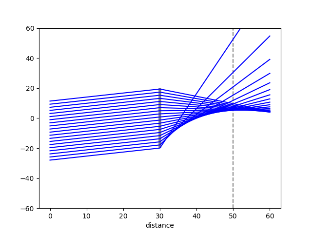

# Ray tracing for 2D ideal metasurface
 Support3 optical elements: freespace, pupil and ideal meta-lens.\
 Will support arbitrary phase modification in future.\
 No installation needed. copy the MetaRay directory to your code dir or add the absolute path of MetaRay to your sys.path.\
 No paraxial approximation, large NA is supported.
# Example: ideal flat lens with oblique incidence.


```
import sys
#module path: the absolute path of the MetaRay directory.
module_path = 'C:/Users/94735/OneDrive - UW-Madison/My Projects/meta_rayoptics/'
sys.path.insert(1, module_path)
from MetaRay import *
import math

optical_path = OpticalPath()
#propagate distance
optical_path.add(freespace(d = 30))
#focal lens and aperature radius
optical_path.add(meta_lens(f = 20, r = 20))
optical_path.add(freespace(d = 30))

radius = 30
N = 30 # number of rays.
y = np.linspace(-radius, radius, N)
theta_deg = 15 
theta = np.ones((N,)) * math.radians(theta_deg)
ray_in = Ray(y, theta)
ray_out = optical_path.run(ray_in)

optical_path.vis_path(y_lim = [-radius * 2, radius * 2])
```